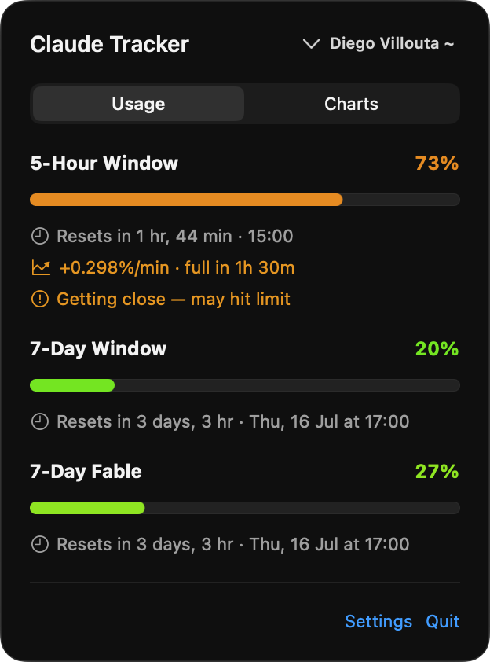
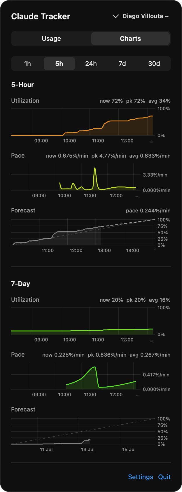
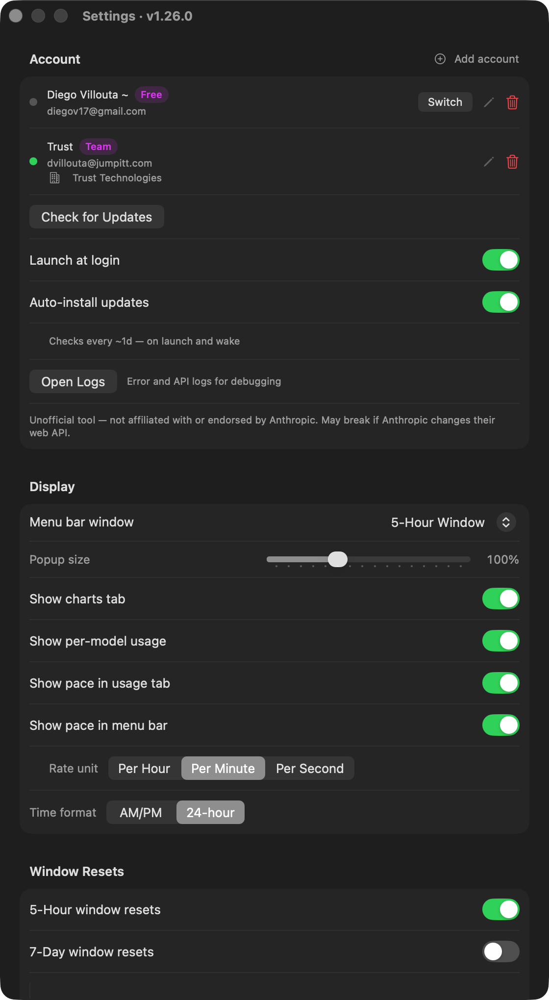

# ClaudeTracker

A macOS menu bar app that shows your [Claude AI](https://claude.ai) usage limits in real time — utilization percentages, progress bars, and countdown timers until each window resets.


## Screenshots

<p align="center">
  
  &nbsp;&nbsp;&nbsp;&nbsp;
  
</p>

<p align="center">
  
</p>

## Features

- Live 5-Hour and 7-Day utilization bars with color-coded thresholds (green / orange / red)
- **Per-model usage** bars (toggleable in Settings) — model-scoped weekly limits reported by the API (e.g. **7-Day Fable**), plus the legacy **7-Day Sonnet** sub-window on accounts that still receive it
- **Multi-account** — sign in to multiple Claude accounts and switch between them from the popover header; each account is isolated in its own browser session (no cookie collisions); per-account chart history and pace state
- Reset countdowns with relative and absolute time ("Resets in 3 hr · 5:30 PM" — AM/PM or 24-hour, configurable in Settings); 7-day windows add the full date when the reset isn't today ("Resets in 6 days · Thu, Jul 9 at 17:00")
- Menu bar icon showing the selected window's utilization percentage; icon and badge use a continuous green → yellow → orange → red urgency gradient
- Subscription badge (Pro, Max 5x, Max 20x, Team, Enterprise)
- **Charts tab** — historical area + line charts for all four windows with selectable time ranges (1h / 5h / 24h / 7d / 30d) and hover-interactive crosshair
- **Pace indicator** — shows current consumption rate (%/hr) and projected time to full; configurable rate window (30s / 1m / 5m / 10m / 15m / 30m)
- **Pace alerts** — toast/sound notification when a window is projected to fill before it resets; auto-dismissed when pace improves past the warning threshold
- **Stale data detection** — if a usage window reset while the Mac was asleep, the app detects it on wake and refreshes instead of showing stale high utilization
- Configurable notifications when a window resets: toast near the menu bar, sound, and system banner
  - Toast duration slider (1-30 s) or permanent mode until dismissed
- **Launch at login** — registers itself as a login item on first run so it's always in the menu bar after a reboot (opt out in Settings; removing it in System Settings → Login Items is respected too)
- **Auto-update** — periodically checks GitHub Releases on an adaptive schedule (based on historical release cadence), checks again on wake from sleep, and auto-installs new versions after a short countdown (**on by default** — opt out in Settings); shows a banner in the popover and a toast when a new version is found
- **Popup scale** — slider (75–150%) to resize the popover proportionally
- **Diagnostic logs** — rolling file log at `~/Library/Logs/ClaudeTracker/`; open directly from Settings
- Adaptive polling — the refresh rate speeds up automatically as usage or pace climbs; nothing to configure
- No API key required — uses your existing claude.ai browser session

## Requirements

- macOS 14 Sonoma or later
- Xcode 15 or later (build from source only)
- [XcodeGen](https://github.com/yonaskolb/XcodeGen) — `brew install xcodegen` (build from source only)
- An active [Claude](https://claude.ai) account (Pro, Max, Team, or Enterprise)

## Installation

### Quick install (recommended)

One command — downloads the latest release, installs to `/Applications`, and launches the app:

```bash
curl -fsSL https://raw.githubusercontent.com/diegovilloutafredes/ClaudeTracker/main/scripts/install.sh | bash
```

No Gatekeeper prompts: `curl` downloads are never quarantined, so this works even though the app is not yet signed with a Developer ID certificate. Once installed, the app keeps itself up to date automatically (see [Updates](#updates)).

### Manual download

Go to [Releases](https://github.com/diegovilloutafredes/ClaudeTracker/releases) and download the latest version. Two formats are provided:

**DMG**
1. Open `ClaudeTracker.dmg`
2. Drag `ClaudeTracker.app` to the `/Applications` shortcut in the window
3. Launch from Applications

**ZIP**
1. Download `ClaudeTracker.zip` and unzip it
2. Double-click `install.command` — it copies the app to `/Applications`, strips the Gatekeeper quarantine flag, and launches it. If macOS blocks the script itself, run `bash install.command` from Terminal instead.

> **Gatekeeper note:** browser downloads are quarantined, and the app is not yet Developer ID-signed, so macOS blocks the first launch of a manually downloaded copy. On macOS 15 Sequoia and later, right-click → Open no longer bypasses this — instead, attempt to open the app once, then go to **System Settings → Privacy & Security** and click **Open Anyway**. Alternatively, clear the flag directly: `xattr -d com.apple.quarantine /Applications/ClaudeTracker.app`. The quick-install script above avoids all of this.

### Updates

Nothing to do — the app checks GitHub Releases on launch, on wake from sleep, and on an adaptive schedule, and installs new versions automatically (a toast shows a ~10 s countdown first). To review updates manually instead, turn off **Auto-install updates** in Settings; you'll then get a notification and an **Install** button in the popover when a new version is available.

### Build from source

The Xcode project is generated from `project.yml` with [XcodeGen](https://github.com/yonaskolb/XcodeGen) and is not committed, so install that first:

```bash
brew install xcodegen
git clone https://github.com/diegovilloutafredes/ClaudeTracker.git
cd ClaudeTracker
make run
```

`make run` generates the project, builds, installs to `/Applications/`, and launches the app in one step. To open in Xcode instead: `make generate && open ClaudeTracker.xcodeproj`.

To package distributable artifacts (DMG + ZIP):

```bash
make release
# Outputs: release/ClaudeTracker.dmg and release/ClaudeTracker.zip
```

To sign and notarize (requires Apple Developer ID credentials):

```bash
make release \
  SIGN_IDENTITY="Developer ID Application: Your Name (TEAMID)" \
  APPLE_ID=you@example.com \
  APPLE_PASSWORD=xxxx-xxxx-xxxx-xxxx \
  APPLE_TEAM_ID=TEAMID
```

### First launch

1. Click the menu bar icon (shows a percentage, or `--` when not signed in)
2. Click **Add a Claude account** — a browser window opens with claude.ai
3. Sign in normally; the app detects the session cookie automatically
4. The window closes and usage data loads within a few seconds

To add a second account, open the popover and click the chevron next to the header → **Add account**. Switching between accounts pivots the menu bar label, popover content, and charts to the selected account; each account's polling, pace history, and reset notifications are tracked independently.

## How it works

Claude.ai uses Cloudflare bot-detection that blocks plain `URLSession` requests. The app loads `claude.ai` in a hidden `WKWebView` and issues all API calls via `callAsyncJavaScript`. Requests originate from a real browser context with the correct cookies, headers, and TLS fingerprint — the same way the web app works.

Each Claude account gets its own `WKWebsiteDataStore(forIdentifier:)`, so cookies (including `sessionKey`) are fully isolated per account. Adding a second account does not log out the first. Sign-in persists across relaunches per account.

## Architecture

| File | Responsibility |
|---|---|
| `ClaudeTrackerApp.swift` | App entry point, `MenuBarExtra` scene, composed menu bar image |
| `ClaudeAPIService.swift` | Hidden `WKWebView` for API calls (per-account `WKWebsiteDataStore(forIdentifier:)`); login page loading and cookie polling |
| `UsageViewModel.swift` | Published state, polling timer, per-account state buckets, UserDefaults persistence, notification dispatch, stale data detection, account add/switch/remove lifecycle |
| `UpdateService.swift` | In-app updates: GitHub-release checking, adaptive schedule, and auto-install (download → unzip → replace → relaunch) |
| `Models.swift` | Codable structs for API responses; `Account` + `AccountStore` + per-account `AccountState`; `MenuBarWindow` display enum; `UpdateInfo`; `computePace()` + pure helpers (`adaptiveCheckInterval`, `isWindowReset`, `windowIsStale`) |
| `LoginView.swift` | `NSViewRepresentable` wrapping the API web view; `LoginWindowController` |
| `ToastWindowController.swift` | Floating `NSPanel`-based toast, positioned near the top-right corner |
| `MenuBarView.swift` | Popover content — scalable progress bars (incl. per-model rows), reset countdowns, charts tab, update banner, account picker |
| `SettingsView.swift` | Accounts list (rename / switch / remove), update checker, popup scale, notification and refresh settings |
| `AppLogger.swift` | Rolling file logger (`~/Library/Logs/ClaudeTracker/`); also writes to `os.log` |

## Disclaimer

This app uses **unofficial, undocumented** internal claude.ai endpoints. It is not affiliated with, endorsed by, or supported by Anthropic. The API may change at any time without notice. Use at your own risk.

## Contributing

See [CONTRIBUTING.md](CONTRIBUTING.md).

## License

MIT — see [LICENSE](LICENSE).
